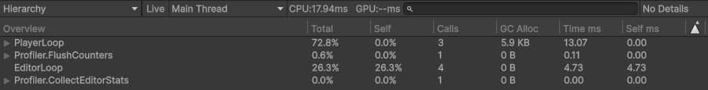
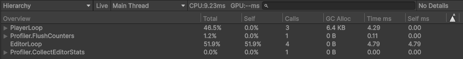
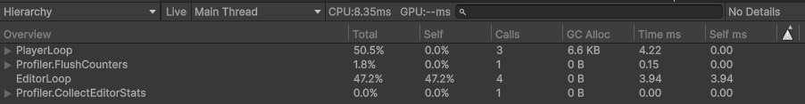

# 다중 인스턴스 성능 - 원인 분석 -> 해결 -> 증거

> ★ 이 레포가 증명하는 두 실무 문제 중 하나. spine-unity 4.3 분리 구조의 함정을 짚고,
> 오프스크린 컬링으로 해결한 과정과 수치.

## 맥락
2D 수집형 RPG에서 **Spine 캐릭터**(mesh deform + IK/transform 제약)를 다수 표시하는 상황.
측정 에셋은 표준 샘플 **spineboy-pro**(spine-unity 4.3) 300체. 커스텀 무거운 에셋이 아니라
*표준 샘플인데도* 다수를 띄우면 per-instance 갱신 비용이 프레임을 지배한다 -
**"인스턴스 수가 곧 비용"인 구조 자체**를 보이는 게 목적(특정 에셋 부하에 기대지 않음).

---

## 1. 문제 (증상)
N개의 스켈레톤을 배치하면 프레임이 급락. **300체 naive ~ 58 FPS**(17 ms/frame).
다수가 화면 밖(스크롤 수집 화면)인데도 느려짐.

## 2. 원인 분석

### 프레임당 인스턴스별 비용
1. `AnimationState.Update + Apply` - 애니메이션 평가
2. `Skeleton.UpdateWorldTransform` + **제약(IK/transform/physics) 솔빙**
3. **`MeshGenerator`** - mesh deform 정점 재생성
4. Mesh 버퍼 업로드

-> 합쳐서 **per-instance 갱신 비용**. 캐릭터가 무겁든 가볍든 *인스턴스 수에 비례*해 쌓인다.

-> 이 비용은 **가시성과 무관하게 매 프레임 발생**한다. Spine은 기본적으로 화면 밖
인스턴스도 풀 갱신하므로, 수집형 스크롤처럼 다수가 오프스크린이면 그만큼 낭비.

### ★ 함정: spine-unity 4.3 분리 구조
4.3부터 **`SkeletonAnimation`(갱신)** 과 **`SkeletonRenderer`(메시 생성)** 가 분리 컴포넌트다.
메시 생성은 `SkeletonRenderer.LateUpdateImplementation` 에서 다음으로 게이팅된다:

```csharp
// SkeletonRenderer.LateUpdateImplementation
if (updateMode != UpdateMode.FullUpdate && wasMeshUpdatedAfterInit) return; // 메시 생성 스킵
```

즉 메시 생성은 **`SkeletonRenderer.UpdateMode`** 로 제어된다. 따라서
`SkeletonAnimation.enabled = false` 만 끄면 애니/physics 는 멈춰도 **메시 생성(지배 비용)은 계속** 돈다.

> 실제로 처음엔 `enabled` 만 토글했고, 그 결과 `Updating: 60/300` 인데 **FPS 는 naive 와 동일**했다.
> -> "갱신을 줄였는데 비용이 안 줄어든" 증상이 곧 이 함정의 신호였다.

## 3. 해결 - `SpineFxManager`

- 등록된 인스턴스를 **게임 카메라 프러스텀**(`GeometryUtility.CalculateFrustumPlanes` +
  `TestPlanesAABB`)으로 가시성 판정.
- **오프스크린 -> `SkeletonRenderer.UpdateMode = Nothing`** : 애니메이션 + 월드 트랜스폼 +
  physics + **메시 생성** 을 통째로 스킵.
- 화면 안 -> `FullUpdate`. 원거리(perspective) -> N프레임 스로틀.
- 렌더는 어차피 Unity 프러스텀 컬링되므로, 오프스크린 갱신 스킵에 **시각적 손해 없음**.

### 왜 "게임 카메라 프러스텀(수동)" 인가
Spine 내장 컬링(`updateWhenInvisible`)은 Unity `OnBecameVisible/Invisible` =
**모든 카메라(씬뷰 포함)** 기준이다. 에디터에서 씬뷰가 인스턴스를 비추면 "보임" 으로 판정돼
컬링이 안 된다. **게임 카메라만** 테스트하면 에디터에서도 정확히 컬링된다.
(내장 `updateWhenInvisible` 도 같은 방향으로 맞춰 둬 빌드에서도 일관.)

### 왜 컬링이 핵심 레버인가
지배 비용은 per-instance 갱신(메시 생성 + 애니/제약)이고, 다수 오프스크린 시 이를
0으로 만드는 컬링이 절약폭이 가장 크다. **2D 수집형 RPG 스크롤 화면** 도메인과 정확히 일치한다.

---

## 4. 증거

| 인스턴스 | naive (전부 FullUpdate) | managed (오프스크린 컬링) |
|---|---|---|
| **300** | **~58 FPS** / Updating 300/300 | **~129 FPS (~2.2x)** / Updating 60/300 (240 컬링) |

### Profiler 상세 (300체, 녹화 OFF/실시간)

| 상태 | CPU 메인 프레임 | 드로우콜 | GC Alloc / frame |
|---|---|---|---|
| **naive** (300 FullUpdate) | **13.07 ms** | 77 | 5.9 KB |
| **managed** (컬링) | **4.29 ms** | 78 | 6.4 KB |
| managed + **MPB Tint** | 4.22 ms | 78 | 6.6 KB |

**naive** (300 FullUpdate) - 13.07 ms



**managed** (오프스크린 컬링) - 4.29 ms



**managed + MPB Tint** - 4.22 ms



**해석 - 절약은 드로우콜이 아니라 CPU per-instance 갱신에서 나온다.**
- **CPU 메인 13.07 -> 4.29 ms (~3.0x 단축)** : 컬링이 오프스크린 240체의 `MeshGenerator`+애니/제약 갱신을
  통째로 스킵한 효과. 화면 FPS 58->129 와 정합한다.
- **드로우콜 77 <-> 78 (사실상 동일)** : Unity 는 *렌더* 를 어차피 프러스텀 컬링하므로 화면 안 인스턴스 수가
  양쪽 같다. 즉 naive 가 느린 건 그릴 게 많아서가 아니라 **안 보이는 인스턴스의 갱신 비용**을 매 프레임
  지불해서다 - 2절 원인 분석(메시 생성이 가시성과 무관하게 발생)을 Profiler 가 직접 확인.
- **GC 5.9 <-> 6.4 KB / MPB Tint 추가에도 4.29 -> 4.22 ms** : per-instance MPB 색의 CPU 비용은 ~0
  (6절 의 "Spine 동적 메시 환경에선 SRP Batcher 손실이 작다" 재확인).

### 측정 방법론 (중요)
- **Profiler / 실시간으로 측정**(CPU ms). 화면 FPS 는 보조.
- **녹화 중 수치 금지** - 녹화 오버헤드가 결과를 왜곡한다:
  - Unity Recorder: 고정 프레임레이트로 정규화해 naive/managed 차이를 가린다.
  - OS 녹화: 비-SRP-batch(MPB) 경로의 CPU 비용을 과장해 노출 -> MPB 비교축까지 왜곡
    (실측 MPB Tint 129->127 무시 수준인데, 녹화 중엔 114->66처럼 보였다).
- 모션 시연만 OS 녹화로, **수치는 항상 녹화 OFF 실시간**에서.

---

## 5. 한계 / 확장
- **전부 화면 안(전투형)** : 컬링 무효. -> MPB 일원화(배칭 유지), `MeshGenerator` 옵션 최소화
  (탄젠트/노멀/멀티텍스처 off), 드로우콜 병합으로 접근.
- **풀링** : 카운트 전환 시 `Instantiate/Destroy` 스파이크(프레임 히치 + GC) 제거.
  벤치에 토글 구현 - 풀에서 `SetActive` 로 재사용하므로 10<->300 전환이 매끈. (정상상태 FPS 가
  아니라 *전환 비용* 을 잡는 레버 - 풀링 OFF 로 전환 시 히치가 드러난다.)
- **거리 스로틀** : 2D 는 인스턴스 거리가 동일해 거의 무효(perspective 용).
- **컬링 복귀 시** 1프레임 메시 재생성 + 애니 시간 점프(`Nothing` 은 시간도 정지).
  동기화가 필요하면 `EverythingExceptMesh` / `OnlyAnimationStatus` 모드로 절충.
- **멀티 블렌드 캐릭터** : 머티리얼 2개 이상(Normal + Multiply 등)인 스켈레톤은 드로우콜이 부위별 분리.
  SpineFx 연출을 입히려면 Multiply 변형 셰이더가 필요.

## 6. SRP Batcher vs MaterialPropertyBlock (트레이드오프 - 면접 포인트)

인스턴스별 색/이펙트를 줄 때 두 경로:

| | 머티리얼 복제(증식) | MaterialPropertyBlock |
|---|---|---|
| 머티리얼 수 | 인스턴스마다 증가 (GC/메모리 증가) | **1종 공유** |
| SRP Batcher | 호환 (CPU 효율적) | **비호환** (해당 렌더러 SRP 경로 제외) |
| Spine 적합성 | **부적합** (아래) | **적합** |

### ★ Spine 특수성 - 사실상 MPB 가 유일한 깔끔한 경로
- **Spine 은 `sharedMaterials` 를 매 프레임 아틀라스에서 재할당**한다(`SkeletonRenderer`).
  -> `renderer.materials` 에 머티리얼 인스턴스를 꽂아도 **다음 프레임 덮여 되돌려진다.**
  즉 Spine 에서 머티리얼 복제 방식 자체가 잘 동작하지 않는다. (실제로 인스펙터에서 머티리얼을
  바꿔도 원복되는 현상으로 확인됨.) **MPB 는 Spine 이 건드리지 않으므로 유일하게 안정적.**
- **Spine 인스턴스는 각자 동적 메시**(매 프레임 생성)라 **드로우콜이 애초에 병합되지 않는다.**
  -> SRP Batcher 가 줄 수 있는 이득(상태 바인딩 비용)이 제한적. 따라서 MPB 로 SRP Batcher 를
  포기하는 손실이 작다.

### 결정
연출 파라미터는 **MPB**(머티리얼 1종 유지 -> 증식/GC 없음 + Spine 호환), 성능은 **컬링**으로
축을 분리. *"Spine 에선 MPB 가 배칭 때문이 아니라 호환성/머티리얼 수 때문에 정답"* 이 핵심 근거.
벤치의 `MPB Tint` 토글로 단일 머티리얼 공유 하에 per-instance 색 변형을 시연한다.

**실측(컬링 ON, 300체, 실시간):** MPB Tint OFF **129** -> ON **127** FPS - per-instance MPB 색의
실제 비용은 **무시할 수준**. "Spine 동적 메시 환경에선 SRP Batcher 손실이 작다"는 가정이 실측으로 확인됨.
(녹화 중엔 114->66처럼 과장돼 보였는데, 이는 녹화 아티팩트 - 위 측정 방법론 참고.)
