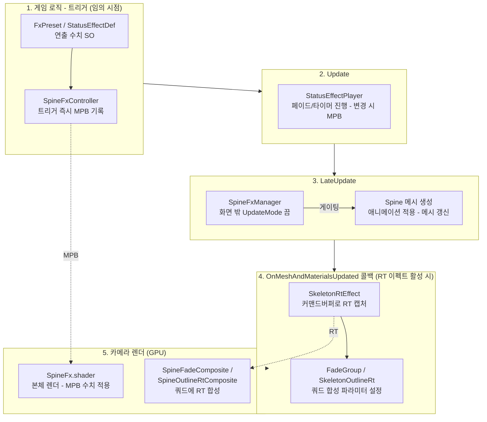
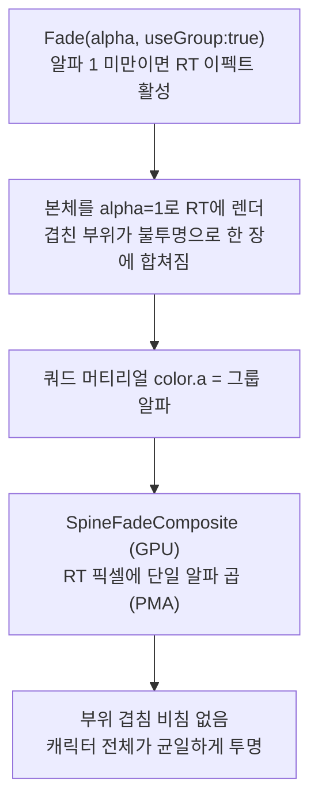
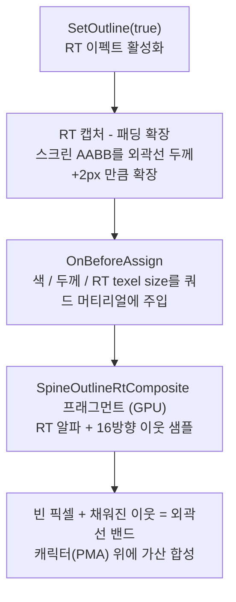

# 프레임 타이밍 - 각 기능이 언제 적용되는가

한 프레임 안에서 각 컴포넌트/셰이더가 실행되는 시점을 정리한 문서.
어떤 기능이 어느 단계에 개입하는지, 무엇이 무엇을 게이팅하는지를 한눈에 보기 위한 지도다.

## 단계별 설명

### 1. 게임 로직 - 트리거 (임의 시점)

`SpineFxController`의 트리거 API(`Play(preset)` / `SetFlash` / `SetTint` / `SetDissolve` / `SetAlpha`)는
호출 즉시 MaterialPropertyBlock에 기록한다 - 렌더 전이면 그 프레임에 바로 반영된다.
연출 수치는 하드코딩이 아니라 SO(`FxPreset` / `StatusEffectDef`)에서 온다.

`Fade(alpha, useGroup:true)`는 `FadeGroup`으로, `SetStatus(def, on)`은 `StatusEffectPlayer`로
위임만 하고, 실제 진행은 아래 단계들에서 일어난다.

### 2. Update

`StatusEffectPlayer`만 이 단계에서 돈다. 상태이상의 페이드 인/아웃과 duration 타이머를
매 프레임 진행시키고, 값이 실제로 변한 프레임에만 MPB를 다시 쓴다.
전 슬롯이 안정 상태(타이머 없음, current == target)면 enabled=false로 잠들고
다음 `SetStatus` / `ClearAll`이 다시 깨운다.

### 3. LateUpdate

`SpineFxManager`가 프러스텀 검사로 화면 밖 스켈레톤의 `SkeletonRenderer.UpdateMode`를
Nothing으로 바꾼다. 이 값이 바로 이어지는 Spine의 애니메이션 적용/메시 생성 자체를
게이팅하므로(다이어그램의 "게이팅" 화살표), 화면 안 스켈레톤만 메시가 갱신된다.
`SkeletonAnimation.enabled=false`로는 mesh deform 비용이 빠지지 않는다 -
UpdateMode 자체를 바꿔야 한다.

### 4. 메시 갱신 콜백 (OnMeshAndMaterialsUpdated)

Spine이 메시를 다 만든 직후 발화하는 이벤트로, 페이드/외곽선이 활성일 때만
`SkeletonRtEffect`가 여기 구독되어 있다. 커맨드버퍼로 스켈레톤을 스크린 bounds 영역만큼
오프스크린 RT에 캡처하고, 서브클래스 훅(`OnBeforeAssign`)에서 `FadeGroup`은 단일 알파를,
`SkeletonOutlineRt`는 외곽선 색/두께를 쿼드 머티리얼에 설정한 뒤 쿼드 메시를 갱신한다
(재사용 배열 - 프레임당 할당 0).

### 5. 카메라 렌더 (GPU)

평소엔 `SpineFx.shader`가 MPB 수치(플래시/틴트/디졸브/상태이상)로 본체를 그린다.
RT 이펙트가 활성이면 본체는 forceRenderingOff로 숨겨지고, 대신 합성 셰이더
(`SpineFadeComposite` / `SpineOutlineRtComposite`)가 쿼드에 RT를 합성한다.
두 경로 모두 PMA(premultiplied alpha)를 유지한다.

## 통합 투명 페이드 과정 (FadeGroup 상세)

타임라인의 1 -> 4 -> 5단계를 가로지르는, 이 리포의 대표 기능(고스팅 해결)이 실제로 동작하는 순서:

1. **트리거 (1단계)** - `Fade(alpha, useGroup:true)`는 본체 MPB 알파를 1로 되돌리고
   `FadeGroup.SetFade(alpha)`를 호출한다. 알파가 1 미만이면 RT 이펙트가 켜지고,
   1 이상이면 RT를 반납하고 일반 렌더로 복귀한다.
2. **불투명 캡처 (4단계)** - 핵심 포인트. 본체를 알파 1(불투명)로 RT에 렌더하므로
   겹친 부위들이 RT 안에서 이미 불투명 한 장으로 합쳐진다.
3. **단일 알파 주입 (4단계)** - `OnBeforeAssign` 훅에서 쿼드 머티리얼 색의 알파에
   그룹 알파를 넣는다.
4. **합성 (5단계, GPU)** - `SpineFadeComposite`가 RT 픽셀 전체에 단일 알파를 곱한다(PMA 유지).
   부위별 알파를 각각 곱할 때 생기던 겹침 비침(고스팅)이 원천적으로 사라진다.

비교용 naive 경로(`useGroup:false`)는 본체 셰이더의 글로벌 알파만 낮추는 방식이라
겹친 부위가 서로 비쳐 보인다 - 데모에서 두 경로를 나란히 비교한다.

## 외곽선이 그려지는 과정 (SkeletonOutlineRt 상세)

타임라인의 4 -> 5단계 안에서 외곽선이 실제로 만들어지는 순서:

1. **활성화 (임의 시점)** - `SetOutline(true)`이 `SetEffectActive`를 호출해 원본을 숨기고
   메시 콜백 구독을 건다. 이후는 매 프레임 4 -> 5단계 경로.
2. **RT 캡처 - 패딩 (4단계)** - 외곽선은 실루엣 "바깥"에 그려지므로 RT가 캐릭터에 딱 맞으면
   선이 잘린다. `ScreenPaddingPixels`(외곽선 두께 + 2px)만큼 스크린 AABB를 확장해
   RT와 쿼드에 여백을 확보한다.
3. **파라미터 주입 (4단계)** - `OnBeforeAssign` 훅에서 외곽선 색/두께와
   RT texel size(1/w, 1/h)를 쿼드 머티리얼에 넣는다.
4. **이웃 샘플 판정 (5단계, GPU)** - `SpineOutlineRtComposite` 프래그먼트가 각 픽셀에서
   RT 알파를 읽고, 외곽선 반경 안 16방향의 이웃 알파 최대값을 구한다.
   자기 픽셀은 비어 있는데(알파 근사 0) 이웃 중 채워진 픽셀이 있으면 외곽선 밴드다.
   (16방향 각도의 cos/sin은 [unroll] 루프 상수라 컴파일 타임에 폴딩된다)
5. **합성 (5단계, GPU)** - 캐릭터(premultiplied) 위에 외곽선 색을 가산하고
   알파를 max로 합쳐 PMA를 유지한다.

per-part 알파 아웃라인과의 차이: RT가 캐릭터를 한 장으로 합친 실루엣이므로
부위 경계(seam)에 선이 끼지 않고, 전체 윤곽 바깥에만 한 줄이 그려진다.

## 타임라인 밖의 생명주기

| 시점 | 동작 |
|---|---|
| Awake | MPB / 쿼드 / 커맨드버퍼 준비, 쿼드 토폴로지 1회 설정 |
| OnDisable | 이벤트 구독 해제, 원본 렌더러 복구(forceRenderingOff 해제), RT 반납 |
| OnDestroy | 런타임 생성한 Material / Mesh / 쿼드 GameObject 파괴 |
