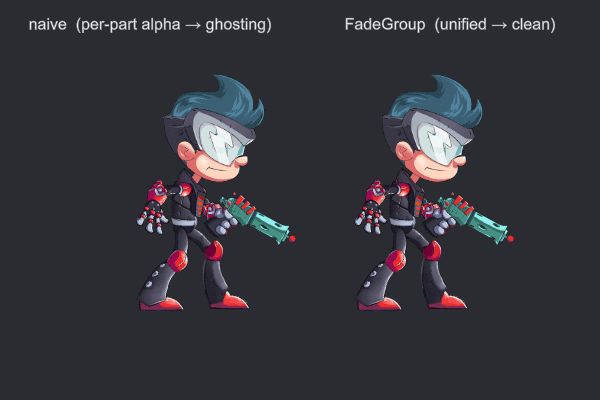
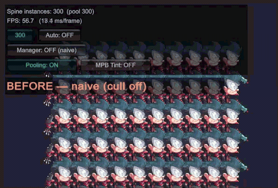
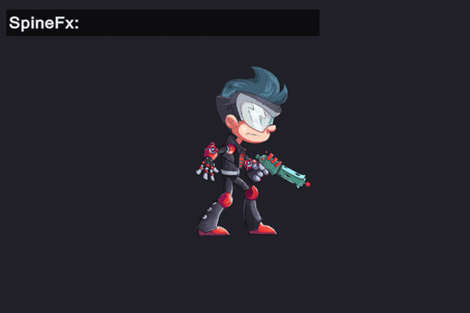

# unity-spine-fx-lab

> Unity 6 (URP 17) 기반 **Spine 2D 런타임 + 셰이더 제어 시스템** 랩
> 셰이더를 코드/데이터로 제어하는 연출 시스템과, 실무에서 부딪히는 두 가지 프로덕션
> 문제(**다중 인스턴스 성능 / 통합 투명 연출**)를 원인 분석 -> 해결 -> 증거로 다룬다.
>
> 작성: 정휘현 / [전체 포트폴리오](https://github.com/Frenil-client/frenil-portfolio)

---

## 이 레포가 증명하는 것
1. **런타임 시스템 설계** - MaterialPropertyBlock 기반 이펙트 제어, 풀링, 데이터 주도(ScriptableObject) 연출 정의
2. **셰이더 직접 작성** - HLSL로 디졸브/히트플래시/상태이상/아웃라인 구현 (variant 전략 포함)
3. **실무 문제 해결 (★)** - 다중 인스턴스 성능 저하, 부위별 alpha 겹침(고스팅)을 원인 분석 -> 구조적 해결 -> Profiler/비교 컷으로 증명

---

## 🖼 갤러리

### ★ 통합 투명 연출 - 고스팅 해결
naive 부위별 페이드(겹침/비침) vs FadeGroup 통합 페이드(클린). 멀티 파츠를 RT에 한 장으로 평탄화한 뒤
단일 알파로 합성해, PMA 블렌딩에서 슬롯마다 알파를 곱할 때 깨지는 차폐를 복원한다.
([상세 분석](Docs/analysis/transparent-ghosting.md))



### ★ 다중 인스턴스 성능 - 오프스크린 컬링
spineboy 300체. 컬링 전/후 FPS 대비. **CPU 메인 13.07 -> 4.29 ms (~3x), 58 -> 129 FPS.**
드로우콜은 77<->78로 동일 - 절약은 그릴 양이 아니라 *안 보이는 인스턴스의 갱신 비용*에서 나온다.
([상세 분석/Profiler 표](Docs/analysis/multi-instance-perf.md))



### 통합 FX 쇼케이스
단일 SpineFx 머티리얼이 디졸브 / 플래시 / 틴트 / 상태이상 / 아웃라인/실루엣을 순회.
수치 효과는 FxPreset, 상태이상은 StatusEffectDef 로 구동 (데이터 주도).



---

## 🛠 환경
| 항목 | 값 |
|---|---|
| 엔진 / RP | Unity 6 (6000.3.x) / URP 17.3.0 |
| 2D | URP 2D Renderer |
| Spine 런타임 | spine-unity 공식 런타임 (Esoteric Software) |
| 셰이더 | HLSL 직접 작성 (MaterialPropertyBlock 친화) |
| 데이터 | ScriptableObject 기반 이펙트 프리셋 |
| 계측 | Unity Profiler / Frame Debugger |

---

## 📁 아키텍처
```
Runtime/
  Core/     SpineFxController / SpineFxManager / MpbEffectBinder / SpineFxBenchmarkSpawner
  Effects/  SkeletonRtEffect(공통 RT 캡처) - FadeGroup(★통합 투명) / SkeletonOutlineRt(전체 윤곽)
            StatusEffectPlayer(상태이상 중첩/만료)
  Data/     FxDefinition(공통 베이스) / FxPreset(SO) / StatusEffectDef(SO)
Shaders/
  SpineFx                ★ 통합 오버레이 - 디졸브/플래시/틴트/상태이상/아웃라인/실루엣 (키워드+MPB)
  SpineFadeComposite     RT 단일 알파 합성
  SpineOutlineRtComposite  RT 전체 윤곽(seam 없음) 합성
  Includes/ SpineFx_Common.hlsl  PMA premultiply / vert / 알파 경계 공용 베이스
```

### 핵심 설계 원칙
- **머티리얼 증식 금지** - 인스턴스별 파라미터는 머티리얼 인스턴스가 아니라 **MaterialPropertyBlock**으로 주입. 머티리얼 1종 공유로 배칭 유지 + GC 억제.
- **핫패스 무할당** - RT 이펙트의 매 프레임 쿼드 갱신(vertices/uv)은 재사용 배열로만 수행, 토폴로지(triangles/normals)는 생성 시 1회 설정. 활성 중 프레임당 관리 힙 할당 0.
- **수명/빌드 안전** - 컴포넌트 비활성화 시 원본 렌더러 자동 복구(OnDisable), 쿼드/메시/RT 정리(OnDestroy). 합성 셰이더는 직렬화 참조로 연결해 빌드 스트리핑을 방지(비어 있으면 에디터에서 자동 채움).
- **PMA(Premultiplied Alpha) 일관성** - Spine PMA 경로를 모든 셰이더에서 명시적으로 처리(straight 입력 -> 셰이더 premultiply, Linear 정합).
- **데이터 주도** - 연출 수치는 하드코딩이 아니라 ScriptableObject(FxPreset/StatusEffectDef)로 정의.
- **트리거 API 분리** - 게임 로직은 `controller.Play(preset)` / `SetStatus(def, on)` / `Fade(alpha, useGroup)` 수준만 호출.

---

## 🧩 셰이더 Variant 전략
런타임에 자주 바꾸는 **수치(강도/색/임계값)** 는 MPB 프로퍼티로, 연출 **종류** 분기는
`shader_feature_local` 키워드로 - 안 쓰는 조합은 빌드에서 스트립되어 variant 폭증을 막는다.

| 키워드 | 이유 |
|---|---|
| `_DISSOLVE_ON` / `_FLASH_ON` / `_TINT_ON` | 연출 토글, 빌드 스트리핑 |
| `_STATUS_ELECTRIC` / `_STATUS_FREEZE` / `_STATUS_POISON` / `_STATUS_SHIELD` | 상태이상별 분기(중첩 가산) |
| `_OUTLINE_ON` / `_SILHOUETTE_ON` | 아웃라인/실루엣 토글 |

-> 전부 단일 **SpineFx** 셰이더에 통합. 한 머티리얼로 여러 연출을 동시에 걸 수 있다.

---

## 🗺 구현 현황
- [x] **통합 FX 셰이더** - 디졸브/플래시/틴트/상태이상(감전/빙결/중독/실드)/아웃라인/실루엣 (단일 머티리얼/MPB 제어)
- [x] **★ 통합 투명 연출** - 스켈레톤을 RT에 불투명 렌더 -> 단일 알파 합성 (부위 비침/고스팅 해결)
- [x] **★ 다중 인스턴스 성능** - 풀링 + 오프스크린 컬링(`UpdateMode`) + MPB 일원화 (spineboy 300체를 129 FPS 로)
- [x] **전체 윤곽 아웃라인** - RT 합성으로 부위 seam 없는 캐릭터 외곽선
- [x] **데이터 주도 + 오서링 툴** - 쇼케이스의 flash/tint/dissolve 를 FxPreset SO 로 구동(`Play(preset)`), 상태이상은 StatusEffectDef. 인스펙터 라이브 프리뷰(플레이 불필요). 새 연출은 SO 추가만으로
- [x] **마감** - 대표 GIF 3종 + Profiler 표 + 분석 노트 3종 + README 갤러리 완성

> ★ 두 문제의 상세 분석은 [`Docs/analysis/`](Docs/analysis) 참조.
> 한 프레임 안에서 각 기능이 개입하는 시점은 [`Docs/frame-timing.md`](Docs/frame-timing.md)에 정리했다.

---

## 📜 라이선스
- 소스 코드: [`LICENSE`](LICENSE) (MIT)
- 아트: spineboy 는 Esoteric Software 공식 예제 (동봉 [`license.txt`](Assets/Art/Spine/spineboy-4.3/license.txt) 기준 비상업 재배포 허용)
- 서드파티 전체: [`THIRD_PARTY_NOTICES.md`](THIRD_PARTY_NOTICES.md) - spine-unity(Spine Runtimes License), URP. **추출 IP 자산 0건.**
